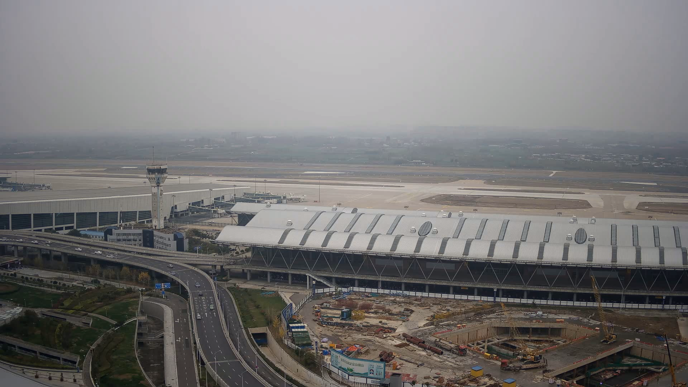
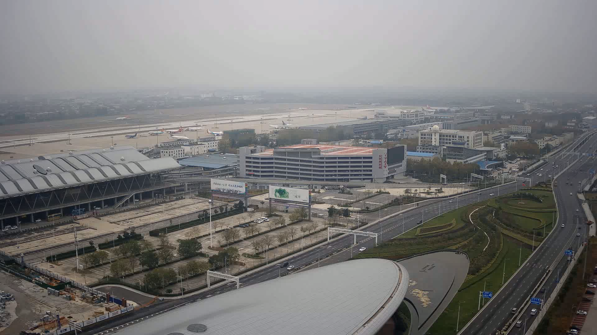

## 0x00 Intro

> This project is a simple implementation of opencv for the following papers.
>
> Du, Chengyao, et al. (2020). GPU based parallel optimization for real time panoramic video stitching. Pattern
> Recognition Letters, 133, 62-69.

Fast panorama stitching method using UMat.

Speed of 4 cameras at 4k resolution is greater than 200fps in 1080ti.

This project does not provide a dataset so it cannot be used out of the box.

一个使用 OpenCV 进行快速全景视频拼接的方法。通过巧妙的流并行策略，在 1080ti 上可以对 4k 视频进行超过 200fps 的图像拼接。

## 0x01 Quick Start

```
$ mkdir build && cd build
$ cmake ..
$ make
 ./image-stitching
```

## 0x02 Example

> About these procedure below (chinese) http://s1nh.com/post/image-stitching-post-process/ .

| 00.mp4                    | 01.mp4                    | 02.mp4                    | 03.mp4                    |
|---------------------------|---------------------------|---------------------------|---------------------------|
|  |  |  |  |

stitching  


exposure-mask  


exposure-mask-refine  


apply-mask


final-panorama


# 记录
## 库版本要求
opencv>=4.5

## 仓库相关
旧仓库地址
cd /userdata/Projects/yzy/gpu-based-image-stitching-dataset-new/gpu-based-image-stitching/
cd /userdata/Projects/yzy/video-stitching/

## ffmpeg
~/dev/ffmpeg
~/dev/ffmpeg60

测试解码器
解码但不复制回。没有 AFBC（ARM 帧缓冲区压缩）。
./ffmpeg -stream_loop -1 -hwaccel rkmpp -hwaccel_output_format drm_prime -i /userdata/Projects/yzy/new-4k-stitch/datasets/4k-test/40.mp4 -an -sn -vframes 5000 -f null -

解码并复制回。没有 AFBC。（AFBC 不能与复制回或 hwdownload 滤镜一起使用）
./ffmpeg -stream_loop -1 -hwaccel rkmpp -i /userdata/Projects/yzy/new-4k-stitch/datasets/4k-test/40.mp4 -an -sn -vframes 5000 -f null -

解码但不复制回。有 AFBC。
./ffmpeg -stream_loop -1 -hwaccel rkmpp -hwaccel_output_format drm_prime -afbc 1 -i /path/to/any-h264-video.mp4 -an -sn -vframes 5000 -f null -

解码但不复制回。如果 RGA3 可用，使用 AFBC。
./ffmpeg -stream_loop -1 -hwaccel rkmpp -hwaccel_output_format drm_prime -afbc rga -i /path/to/any-h264-video.mp4 -an -sn -vframes 5000 -f null -

确认能连接到60版本的ffmpeg,,你要看到的是 libavcodec.so.60，而不是 so.59
ldd ./image-stitching | grep avcodec

在 RK3576 上，真正高性能的路线通常会是这种思路：
rkmpp 输出硬件 buffer / drm_prime
RGA 直接在硬件 buffer 上做格式转换 / resize / copy
后处理继续消费这个设备 buffer
尽量不落回 CPU 内存
问题在于，你现在的 image_stitcher 是基于 OpenCV 的 UMat/remap/multiply/add 写的，而不是基于 RK buffer/DRM/RGA buffer 写的。两边的内存模型不是一套东西。

真硬解已成功
但性能收益被 NV12 -> BGR -> UMat 吃掉了大半

现在 RK 硬解开启时，不再走 sws_scale 做 CPU 转色，而是调用 librga 的 imcvtcolor；启动日志也会明确打印 color_convert=RGA

让硬解结果直接进入 GPU/设备侧后处理
避免 CPU <-> GPU 来回搬运

低风险路线
保留 rkmpp + RGA，去掉 UMat，改成全链路 cv::Mat
这是最容易落地、最快验证收益的方案。
``负收益``

最高性能路线
重构拼接链，让它直接消费 RK 硬件 buffer / DMA-BUF / DRM buffer。
这才是真正“硬解后直接传 GPU”，但改动会非常大，基本不是当前 image_stitcher 这套 OpenCV 代码的小修。

✅ 对接 FFmpeg rkmpp（DMA零拷贝）
✅ 或直接改成 RGA全硬件拼接版本（性能再翻倍）

现在的数据流是：
rkmpp 解码->RGA 转 BGR->直接以 cv::Mat 入队->App 取 Mat->ImageStitcher 全程用 Mat 做 remap/blend/copy

VPU (rkmpp) → DMA buffer (NV12)
        ❌
OpenCV UMat → BGR (OpenCL/CPU)


## 新仓库地址
cd /userdata/Projects/yzy/new-4k-stitch

opencv4.9地址
cd /userdata/Projects/yzy/opencv/opencv-4.9.0/build

## 打开虚拟环境流程
cd /userdata/Projects
激活环境：source rknn-env/bin/activate
cd /userdata/Projects/rknn-toolkit2/rknn-toolkit-lite2/examples/Detect2/code/UI。
然后输入./run_ui.sh或python main.py运行。

# 仓库远程操作命令
## 克隆仓库
git clone <仓库URL>
## 查看本地仓库状态
git status
## 添加所有变更到暂存区
git add .
##  提交到本地仓库
git commit -m "提交说明"
##  推送到远程仓库
git push
### 首次推送并建立追踪关系
git push -u origin <本地分支名>
## 拉取远程更新
git pull
## 从dataset分支拉取仓库
git pull origin dataset

## 查看分支
本地分支：git branch
远程分支：git branch -r
所有分支（本地+远程）：git branch -a
## 新建分支
仅创建分支（不切换）：git branch <新分支名>
创建并切换到新分支：git checkout -b <新分支名> 或 git switch -c <新分支名>
## 切换分支
git checkout <分支名> 或 git switch <分支名>
## 撤销与回退
撤销工作区的修改（未暂存）：git checkout -- <文件>
撤销暂存区的文件（回到工作区）：git reset HEAD <文件>
回退到上一个提交（保留工作区修改）：git reset --soft HEAD^
彻底回退到某个提交（丢弃之后的所有修改）：git reset --hard <commit-id>
# 回退版本 (git reset)
git reset 是 Git 的“时光机”中最强大的命令之一。它可以将你的项目回退到指定的版本。它有三种主要的模式：--soft、--mixed（默认）和 --hard。

为了理解这三种模式的区别，我们再次回顾 Git 的三个核心区域：工作区、暂存区和版本库。

假设我们的提交历史是 A -> B -> C，当前在 C 版本。我们现在想回退到 B 版本 (git reset B)。

--hard 模式：彻底回退
这是最彻底、也是最“危险”的回退模式。它会完全丢弃回退点之后的所有改动。

git reset --hard <commit_hash>
执行效果：
版本库：从 C 回退到 B。
暂存区：内容被清空，与 B 版本保持一致。
工作区：所有文件都被强制恢复到 B 版本时的状态。你在 C 版本所做的所有修改（包括 hello.py 中新增的那一行）都会彻底消失。
适用场景：当你确定要完全放弃某个版本之后的所有修改时使用。请谨慎使用，因为工作区的修改将无法恢复！
示例：
假设 B 版本的 commit hash 是 1a2b3c4
git reset --hard 1a2b3c4


GPU warp 很快，只有约 4 ms
warp 内部 4 路累计也才 12 ms
真正慢的是读视频和等下一帧，约 400 ms

app.cc
现在不再用 4 个 host 线程并发提交 WarpImages()，而是顺序提交 4 路 warp。启动时也会打印：
[App] GPU stability experiment mode: sequential warp submission enabled.

image_stitcher.cc
去掉了每帧的 clone() 和中间 dst.copyTo()，改成直接：

预分配 tmp_umat_vect_[img_idx]
remap(image_vector[img_idx], tmp_umat_vect_[img_idx], ...)


你这次“顺序提交 warp + 去掉 clone/copyTo 中间副本”的实验是有效的。
它已经基本消掉了之前最可怕的 remap=300ms+ 那类大抖动。
你这个实验版已经证明：
“增加 GPU 线程数”不是正确方向
“顺序提交 + 减少副本”是对的方向


当前 GPU 的主问题不是 remap 算得慢，也不是 compose 代码本身慢，而是 OpenCL 队列同步等待时间非常大。
remap_stage 基本只有 0.7 ~ 1.2 ms
compose_stage 大多数时候只有 4 ~ 5 ms
真正大的部分在：
remap_finish = 60 ~ 150 ms
compose_finish = 60 ~ 110 ms

主机侧提交 OpenCL 操作很快
真正慢的是 GPU/驱动在后台执行和清空队列
cv::ocl::finish() 把这些等待显式暴露出来了

再往下推一层，当前最可能的瓶颈是这几类：
UMat 路径背后的 OpenCL 实现/驱动调度效率不高
Mali GPU 上 remap + multiply + add + copyTo 这一串 kernel 之间存在较重的队列/内存同步成本
瓶颈更像内存带宽/缓存同步，而不是算术吞吐
GPU=24.75% 这个指标不能代表“还有很多空闲算力能靠多线程吃满”

减少 OpenCL kernel 次数
现在每帧每路大致有：
remap
multiply
multiply
add
copyTo
这会产生很多独立 kernel / 数据同步点。
最有价值的方向是减少 kernel 链长度。


我看完这份日志后，结论可以分成两层：
第一层，RecordBreakdown 里面谁最慢。
在这份 run_20260326_174241.log 里，共统计到 158 帧有效 RecordBreakdown：
平均 RecordBreakdown.total = 847.5 ms
其中平均 read_total = 561.9 ms，占 66.3%
平均 queue_wait_total = 285.7 ms，占 33.7%
第二层，它是不是最影响整体速度。
这里要特别注意：RecordBreakdown 不是主线程单帧墙钟时间，而是 4 个录制线程累计出来的总和。代码里在 sensor_data_interface.cc (line 184) 对每路分别做 read() 计时，在 sensor_data_interface.cc (line 192) 统计队列等待，然后在 app.cc (line 511) 打印“总 read + 总 queue_wait”。因为这是 4 路并行线程的累加，所以它天然会比主线程一帧时间大很多。
从“真正影响程序总吞吐”的角度看，这份日志里主线程平均是：
StageTime.total = 215.8 ms
fetch = 4.2 ms
gpu_warp = 211.6 ms

queue_wait_total 平均有 285.7 ms，说明生产者线程经常在等队列空位。结合 sensor_data_interface.cc (line 57) 默认队列长度只有 2，这基本表示“读视频线程并没有拖垮主线程，反而常常比主线程更快，结果卡在队列满”。所以：
想降低 RecordBreakdown 数值本身，优先优化视频读帧/解码
想提升整程序 FPS，优先优化 gpu_warp


关键发现
当前版把原版每帧的 4 路并行 warp 改成了串行两阶段执行，这是最可能导致 FPS 从 50+ 掉到个位数的主因。
原版在 assets/app.cc (line 271) 到 assets/app.cc (line 284) 为每路图像起一个 std::thread，并行调用 WarpImages。
当前版在 src/app.cc (line 391) 到 src/app.cc (line 416) 是：
先串行跑 4 次 RemapImage
再 cv::ocl::finish()
再串行跑 4 次 BlendComposeImage
再 cv::ocl::finish()
这会把原本可并发的工作拆成更强同步的串行路径。

当前版的单路处理逻辑也比原版更重。
原版 assets/image_stitcher.cc 的 WarpImages 主要是：
一次 remap
一次 ROI 拷贝到全景图
用 mask 防黑边
当前版 src/image_stitcher.cc 则拆成：
RemapImage
BlendComposeImage
每帧做多次 ROI 边界修正
可能做 resize(weightMap)
multiply + add 融合
再做 compose
也就是说，不只是“线程少了”，而且“每帧干的活更多了”。

当前版多了一个额外的 GPU 强制同步点，会进一步拉低吞吐。
原版在 assets/app.cc (line 286) 和 assets/app.cc (line 293) 只在 warp 后、post 后各做一次 cv::ocl::finish()。
当前版在 src/app.cc (line 402) 和 src/app.cc (line 419) 在 remap 和 compose 中间就先 finish() 一次，相当于把 GPU 流水线拆断了。

当前版每帧日志量远大于原版，还把输出同时写到终端和日志文件，确实会额外拖慢，但这更像次要因素。
当前版在 src/app.cc (line 67) 到 src/app.cc (line 93) 用 TeeStreamBuf 双写日志，然后每帧打印 6 到 7 行详细统计。
原版在 assets/app.cc (line 315) 基本只打一行。
这会有损耗，尤其在板端存储和串口/终端较慢时更明显，但单看你现在日志里的 200ms 级 gpu_warp，它不是第一主因。

FPS 公式本身和原版口径一致，不是“算错了导致看起来变慢”。
原版 assets/app.cc (line 310) 到 assets/app.cc (line 317) 用 fps = 1 / total_time。
当前版 src/app.cc (line 458) 到 src/app.cc (line 463) 也是按总帧时间算 actual_fps。
而且新日志 run_20260326_180658.log 里像：
total=223.538 ms -> actual_fps=4.474
total=211.724 ms -> actual_fps=4.723
结论
对比后，当前工程里“只有 3 FPS”最可疑的并不是拼接算法本身退化成了原版的 1/20，而是“统计口径变了 + 每帧落盘 + 额外同步/日志”这几项叠加。

主要发现
原版 assets 的 “80+ FPS” 很大概率是“GPU 任务提交速度”，不是“这一帧真正做完”的速度。原版在 assets/app.cc 记 t2 后就直接算 1 / (t2 - t0)，但没有像当前工程这样在 warp 后强制 cv::ocl::finish()。当前工程在 src/app.cc 加了 cv::ocl::finish()，所以把之前被 OpenCL 异步隐藏掉的 GPU 执行时间全算进来了。你日志里 gpu_warp=260~340ms，但 WarpBreakdown total 只有 20~100ms，这正是“提交很快，真正执行很慢”的典型表现。也就是说，原版的 80 FPS 很可能并不是真实吞吐。

当前工程默认每帧保存 PNG，这个是真正会把实时帧率打爆的。默认开启在 src/app.cc，逐帧 imwrite 在 src/app.cc。最新日志 run_20260326_212614.log 里 post=622~1785ms，远大于 fetch 和 warp，本质上已经说明“后处理/落盘”才是端到端 FPS 的最大瓶颈。原版虽然也写图，在 assets/app.cc，但它打印了两个 FPS，前一个故意没把 imwrite 算进去，后一个 Real FPS 才更接近真实值。

当前工程的拼接画布比原版更保守，可能更大，导致 setTo(0)、ROI 拷贝和 imwrite 成本更高。当前是按 max(roi.x + roi.width) / max(roi.y + roi.height) 建画布，在 src/app.cc；原版是简单“宽度求和 + 第一张高度”，在 assets/app.cc。如果当前 ROI 有偏移，画布会更大。

当前 WarpImages 其实比原版 assets 更轻，不像是主退化点。当前实现直接 remap -> copyTo(tmp) -> copy ROI，在 src/image_stitcher.cc；而原版有 clone()、更多打印、更多边界检查和融合逻辑，在 assets/image_stitcher.cc。所以“当前拼接核函数本身变慢很多”这个判断，证据并不强。

为什么会这样
开启保存时，主线程被 imwrite 卡在 post 阶段 1.5 秒左右。
这段时间里后台 RecordVideos 线程有足够时间把队列填满，所以主线程下一轮取帧几乎不用等，导致 fetch≈0ms。
也就是说，run_20260326_224245.log 里高得离谱的 assets_style_fps，本质是“主线程前一帧正在慢慢存盘，采集线程已经提前把下一帧准备好了”。

关闭保存后，主线程不再被 post 阻塞，马上进入下一轮 get_image_vector()。
这时真正的瓶颈暴露了：视频解码/生产线程跟不上，主线程大量时间都在等下一帧到来，所以 fetch 暴涨到 200ms+。
这在 run_20260326_225555.log 里非常明显，而且 FetchBreakdown 显示主要卡在 stream0_wait。

你的 assets_style_fps 只统计 fetch + gpu_warp，不统计 post。
所以：
开启保存时，它把巨慢的 imwrite 排除掉了，于是“看起来很高”。
关闭保存时，没有了那段“给后台线程补帧的空闲时间”，fetch 反而把真实采集瓶颈暴露出来，于是“看起来很低”。

开启保存时的高 FPS 是“假高”，因为慢的是 post，但你当前这个 FPS 指标没把 post 算进去；关闭保存后，采集/解码等待不再被 post 掩盖，所以真实瓶颈转移到 fetch，FPS 就掉下来了。


string warp_type = "spherical";    // 变形类型，不要擅自改这个！！！！很影响FPS
代码会根据 warp_type 选择：
PlaneWarper
CylindricalWarper
SphericalWarper
PaniniWarper


你现在图里的现象是：

每一路图像都像一张单独的倾斜/弯曲纸片
四张之间还能看到黑底和各自边界
这说明不是“全景投影本身有点弯”，而是“每一路投影后的图没有被正确裁 ROI 再拼起来”
这和当前代码里的两个改动高度一致：

当前 src/app.cc 的画布计算方式改成了：
total_cols_ = max(roi.x + roi.width)
total_rows = max(roi.y + roi.height)
这会保留每路 ROI 的原始 x/y 偏移，把 warped 图像散着放在大画布里。

而原版 assets/app.cc 的逻辑是：
宽度直接累加每路 ROI 的 width
高度取统一高度
本质是把各路 ROI 裁出来后“排成一条带状全景”
当前 src/image_stitcher.cc 的 WarpImages() 里，直接把
src_rect = (0,0,w,h)
dest_rect = roi_vect_[img_idx]
也就是把 warped 图像左上角区域直接丢到画布的 roi.x, roi.y 上。

而原版 assets/image_stitcher.cc 的做法不是这样。原版会：

用 roi_vect_[img_idx] 作为源图上的裁剪 ROI
目标位置按前面各路 width 累加，y=0 排布
这样每一路只取有效区域，不会把整张 warped 后的外轮廓露出来
这正是你现在图里“每张图都像被单独投影后贴到黑底上”的直接原因。

已经改回“ROI 裁出来后顺排成一条带状全景”的方式了。
现在的关键变化是：
src/app.cc 开始，画布宽度改成了所有 roi.width 的累加，高度取最大 roi.height
src/image_stitcher.cc 开始，不再按 roi.x/roi.y 把整张 warped 图贴到大画布上
改成了从每路 warped 图里按 roi_vect_[img_idx] 裁 safe_roi
然后把它拷到目标图的 y=0 条带位置，x 由前面各路 roi.width 累加得到

# 当前调整相机内外参数，即KMat/RMat矩阵，以免产生畸变


## 输出参考
现在程序会输出两类统计：

初始化阶段
会打印一行 [Timing][Init]，包含：
input_init：输入源初始化
results_dir：结果目录和摘要文件准备
first_frame_fetch：首帧读取
first_frame_copy：首帧拷贝到 Mat
param_generation：参数生成，包括 K/R 读取、去畸变映射、重投影映射、warper 初始化
stitcher_setup：拼接器参数装载
output_buffer_alloc：输出全景缓冲区分配
total：初始化总耗时
每帧运行阶段
会打印一行 [Timing][Frame]，包含：
clear：清空输出画布
load：从队列中取一组输入帧
warp_cpu_dispatch：CPU 侧提交 remap/拼接任务和线程 join
warp_gpu_sync_est：OpenCL finish() 等待时间，作为 GPU 执行耗时估计
post_cpu：后处理 CPU 耗时
post_gpu_sync_est：后处理后的 GPU 同步估计时间
save_final：保存最终结果图耗时
save_diagnostic：保存诊断图耗时
metrics：采集 GPU/NPU 使用率和日志输出耗时
total：整帧总耗时
fps：整帧吞吐


SAVE_STITCH_FRAMES
控制是否保存最终拼接结果到 results/<run>/final_frames/
1 开启，其他值或未设置按默认
默认值：true
SAVE_DIAGNOSTIC_FRAMES
控制是否保存诊断图片到 results/<run>/diagnostic/
包括 input_cam_x.png、warp_cam_x.png、panorama_raw.png、panorama_final.png
1 开启，其他值或未设置按默认
默认值：true
SAVE_FRAME_INTERVAL
控制最终结果图保存间隔
0 表示每帧都保存，30 表示每 30 帧保存一次
默认值：30
DIAGNOSTIC_FRAME_LIMIT
控制最多保存多少帧诊断图
默认值：3
输入源相关

INPUT_SOURCE_MODE
控制输入来源
可用值：dataset、camera
当前默认值：dataset
KMat 调试相关

STITCH_K_FOCAL_SCALE
全局同时缩放 fx/fy
默认值：1.0
STITCH_K_FX_SCALE
全局缩放 fx
默认值：1.0
STITCH_K_FY_SCALE
全局缩放 fy
默认值：1.0
STITCH_K_CX_OFFSET
全局平移 cx
默认值：0.0
STITCH_K_CY_OFFSET
全局平移 cy
默认值：0.0


另外我还加了运行时微调环境变量，不用每次改文件重编译：

STITCH_K_FOCAL_SCALE
STITCH_K_FX_SCALE
STITCH_K_FY_SCALE
STITCH_K_CX_OFFSET
STITCH_K_CY_OFFSET
也支持按相机单独调：

STITCH_K_FOCAL_SCALE_CAM_0
STITCH_K_FX_SCALE_CAM_1
STITCH_K_FY_SCALE_CAM_2
STITCH_K_CX_OFFSET_CAM_3
STITCH_K_CY_OFFSET_CAM_0

画面整体还有轻微“鼓/瘪”感：先调 STITCH_K_FOCAL_SCALE
某一路和相邻画面接缝上下不顺：先调该路 STITCH_K_CY_OFFSET_CAM_x
某一路和相邻画面左右接不上：先调该路 STITCH_K_CX_OFFSET_CAM_x

# 硬件解码 
宏RK_HARDWARE_DECODING决定使用哪种解码方式

cd build
cmake -DENABLE_RK_HARDWARE_DECODING=ON ..
make

# 建立SSH连接

1. 手动设置电脑的 IP 地址
Windows：
打开“网络和 Internet 设置” → 更改适配器选项 → 右键点击使用的以太网卡 → 属性 → 选择“Internet 协议版本 4 (TCP/IPv4)” → 手动设置：
IP 地址：192.168.0.100（或其他不在冲突的地址，如 2~254）
子网掩码：255.255.255.0
默认网关：留空或填写 192.168.0.1
Linux / macOS：
在终端执行：
bash
**sudo ifconfig end1 192.168.1.100 netmask 255.255.255.0 up**
（将 eth0 替换为实际网卡名，如 enp0s 等）

2. 测试网络连通性
在电脑上打开命令提示符（Windows）或终端（Linux/macOS），执行：
bash
ping 192.168.1.10
如果收到回复，说明网络已通。

3. 使用 SSH 客户端连接
Windows 用户（推荐使用 PowerShell 或 Putty）
PowerShell / CMD（内置 OpenSSH 客户端）：
bash
ssh root@192.168.0.10
Putty：
主机名填写 192.168.0.10，端口 22，连接类型 SSH，然后点击“Open”。


https://github.com/nyanmisaka/ffmpeg-rockchip/wiki/Compilation

# Native compilation on ARM/ARM64 host

# Build MPP
mkdir -p ~/dev && cd ~/dev
git clone -b jellyfin-mpp --depth=1 https://gitee.com/nyanmisaka/mpp.git rkmpp
pushd rkmpp
mkdir rkmpp_build
pushd rkmpp_build
cmake \
    -DCMAKE_INSTALL_PREFIX=/usr \
    -DCMAKE_BUILD_TYPE=Release \
    -DBUILD_SHARED_LIBS=ON \
    -DBUILD_TEST=OFF \
    ..
make -j $(nproc)
make install


# Build RGA
mkdir -p ~/dev && cd ~/dev
git clone -b jellyfin-rga --depth=1 https://gitee.com/nyanmisaka/rga.git rkrga
meson setup rkrga rkrga_build \
    --prefix=/usr \
    --libdir=lib \
    --buildtype=release \
    --default-library=shared \
    -Dcpp_args=-fpermissive \
    -Dlibdrm=false \
    -Dlibrga_demo=false
meson configure rkrga_build
ninja -C rkrga_build install


# Build the minimal FFmpeg (You can customize the configure and install prefix)
mkdir -p ~/dev && cd ~/dev
git clone --depth=1 https://github.com/nyanmisaka/ffmpeg-rockchip.git ffmpeg
cd ffmpeg
./configure --prefix=/usr --enable-gpl --enable-version3 --enable-libdrm --enable-rkmpp --enable-rkrga
make -j $(nproc)

# Try the compiled FFmpeg without installation
./ffmpeg -decoders | grep rkmpp
./ffmpeg -encoders | grep rkmpp
./ffmpeg -filters | grep rkrga

# Install FFmpeg to the prefix path
make install